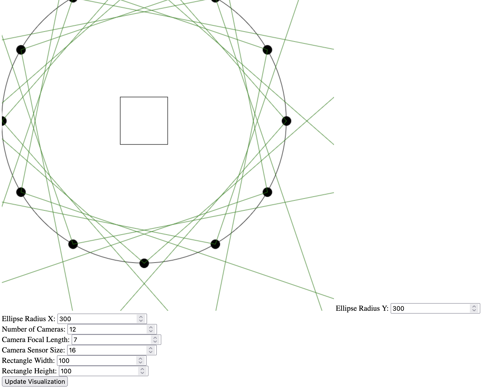
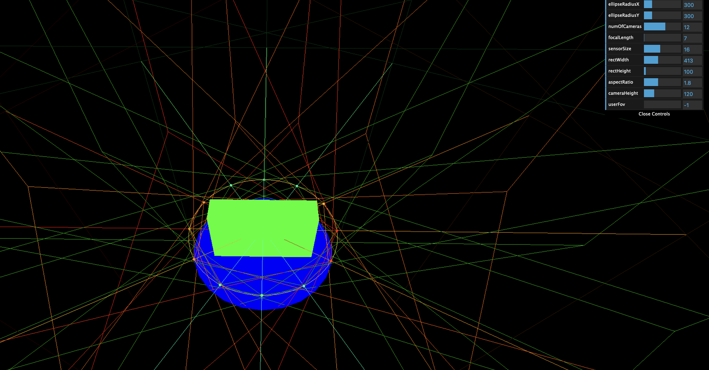

# Visualization

Visualizes the camera setup of a circular capture setup and checks if the rectangular capture space is within view of each camera.

If a camera does not completely capture the space, its frustum is colored in red.

Note: the 2D version currently more evenly distributes the points on an elliptic setup than the 3D version does.

## 2D Version

To use just open [index.html](2d/index.html).

## 3D Version

FOV is either calculated from sensor size and focal length, or given directly by the user.

VFOV and HFOV are calculated given the FOV and the aspect ratio. 

### Install

Run `npm install` from within the `3d` directory.

### Run

Run server with `npx vite`.